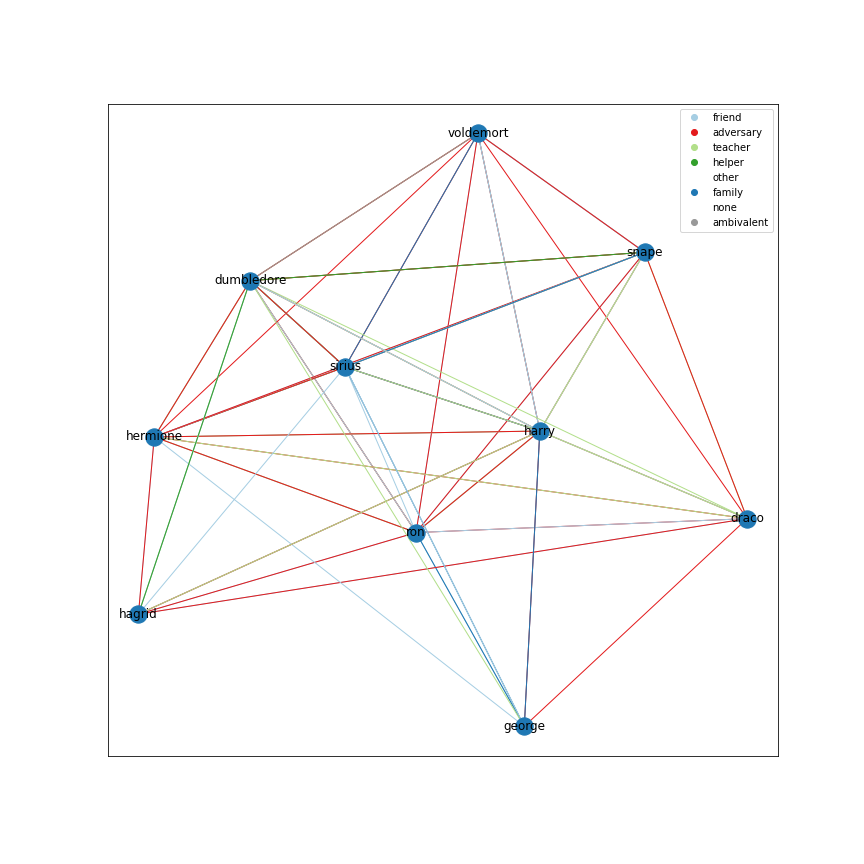
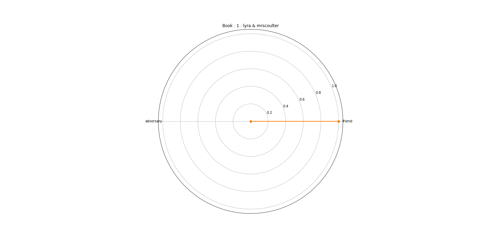

# Report on Literary Relations Project (potter_graph)

A brief report on work so far.

## Motivation

- Use a graph based approach to create explicit character relation labels i.e bill & ted = friends, luke & lea = family, Harry & Voldemort = adversaries.

- Interpret age relations based on character relations for unannotated literary series.

## Approach

- Take the Cafyr Corpus for the Harry Potter series and train an unsupervised clustering model to  recognise character relations. 
- Prune clusters and convert into supervised task using macro annotation of graphs and character matrices.
- Train supervised models to recognise relations.
- Test and retrain models in further literary worlds i.e Pullman's 'HDM'

## Hypothesis

Character relations could be classified using a manually annotated corpus and unsupervised clustering. Furthermore, the resultant model would be able to classify relations in external unannotated texts.

## Evaluation

1. Use accuracy metrics (AUC & F1-score) to evaluate model predictions for relations based on character matrices.

2. Compare model predictions to close reading, where manual annotation highlights character relations  at a sentence level. I.e. specifying changes in characters' relationship within a body of text, and testing the models accuracy.
3. Compare age relation predictions based on ground truth character matrices. i.e combine the character matrices into age matrices, and take model accuracy. 
4. **Possible Idea** : Compare age relation predictions to qualitative annotator survey. Rough example : In Harry Potter, How would you describe the relationship between young and old?.

## Analysis

- Quantitative overview.
  - [Classification Report](#supervised-accuracy)
- Error analysis of model performance. i.e. look at false relationships, and search for patterns.
- Correlation analysis for Age groups and relations.
  - Heatmap of age groups and relation types.
- Compare predicted and ground truth network representation of **characters** in both worlds.
  - **HP** [network graph](#Character-relations-in-Home-World) with True and predicted relations.
  - **HDM** [network graph](#Character-Relations-in-Pullman) with True and predicted relations.
- Compare predicted, ground truth, and qualitative, network representation of **age groups** in both worlds.
  - **HP** network graph with True and predicted relations. 
  - **HDM** network graph with True and predicted relations.
- A case study on a specific character relationship's evolution through the HP series.
  - [Radar plots](#Radar-plots-of-potter) for each book of the **HP** series, showing a relationship between two characters.
- A case study on one age relationship.
  - [Radar plots](#Age-Relations) for each book of the **HP** series, showing relations between multiple age groups.

<!-- ## Parsing -->

<!-- ### Named Entity Recognition -->

<!-- ### Character Identification  -->

## Unsupervised Relationship Learning

The CAFYR annotated corpus was converted into training samples  of :

[source_character, text_in_between, target_character]

Clustering algorithms were used to cluster relation types together. 

### Graph Interface

Screen shot of graph interface

### Labels

Relations were pruned to align with existing character relations:

- friend
- adversary
- teacher
- helper
- other
- family
- none
- ambivalent

## Supervised Classification

### Macro Annotation with Character Matrix

Creating a supervised task using a character relation matrix : 

|           | harry       | voldemort   | hermione   |
|:----------|:------------|:------------|:-----------|
| harry     | protagonist | adversary   | friend     |
| voldemort | adversary   | nan         | adversary  |
| hermione  | friend      | adversary   | nan        |

### Data Representation

X : [source_character_txt, text_in_between, target_character_txt]

y : [relation_label]

Text input to models trained to predict categorical 1d arrays (n_classes).

### Supervised Accuracy

| train          | test           |   precision |   recall |       f1 |   support |
|:---------------|:---------------|------------:|---------:|---------:|----------:|
| potter         | potter         |    0.92 | 0.78  | 0.86 |      2302 |
| potter         | pullman        |    0.80  | 0.63 | 0.68  |      5841 |
| potter_pullman | potter         |    0.92  | 0.77 | 0.71  |      5841 |
| potter_pullman | potter_pullman |    0.78 | 0.57 | 0.59 |      5826 |
| potter_pullman | pullman        |    0.92  | 0.67 | 0.71  |      5841 |
| pullman        | pullman        |    0.59 | 0.41   | 0.43 |      1243 |

### Native World : potter > potter

Predict character relations on an unseen portion of the native literary world.

f1 : 0.87

### Non-native World with Character Matrix : pullman_potter > pullman

Add to the native training with finetuning in new literary world.

f1 : 0.72

### Non-native World without Character Matrix : potter > pullman

Train on a new literary world with without finetuning.

f1 : 0.68

## Close Annotation

The final step is to perform close annotation of prose that signifies character relations per sentence. Therefore, if characters' relations change during a book or chapter it would be represented in the test data. We would then be able to get a further accuracy score.

## Qualitative age Relations [Possible Idea]

Age relations could be annotated on a higher level for each literary world using surveys with readers. i.e How does age group x relate age group y in Harry Potter. We could then compare model predictions to this as well. 

# Analysis

Below is verbose list of relation representations based on the trained model. 

## Character relations in Home World

# Character Relations in Pullman

# Radar plots of potter

# Radar plots of pullman

# Age Relations

